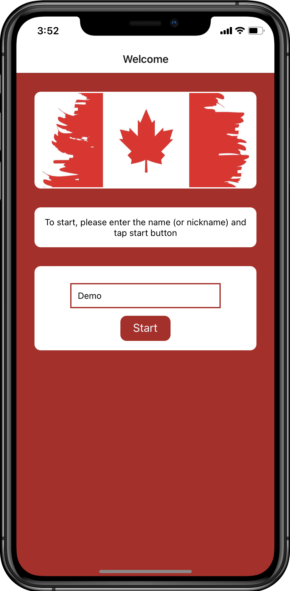

# Canadian Citizenship Eligibility Calculator

## Introduction

This is a mobile app that allows users to calculate their eligibility date towards applying Canadian citizenship. This app gets user's history about their study, work and travel period as well as PR date to determine the earliest application date for Canadian citizenship. This app has not been published yet and only gives an idea about approx. application date. The purpose of this project is to develop a mobile app, improve and practice my React Native skills.

## Built with

\*React Native

## Features/Technologies used

*Expo cli
*React Native Async Storage
*React Native Vector Icons
*React Native Date Picker
*React Native Radio Buttons Group
*Moment.js

## Screenshots

### Home Page

<!-- <table>
 <tr>
  <td></td>
  <td></td>
 </tr>
</table> -->

&nbsp;&nbsp;

### Questions

&nbsp;&nbsp;

&nbsp;&nbsp;

### Summary

### Result

